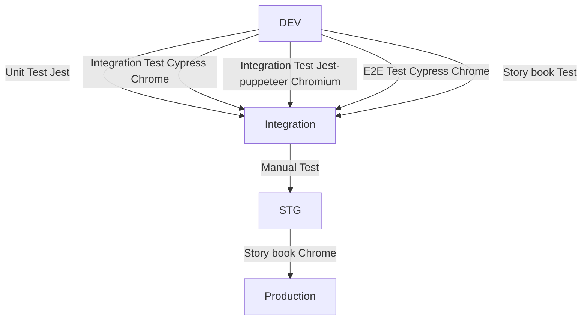
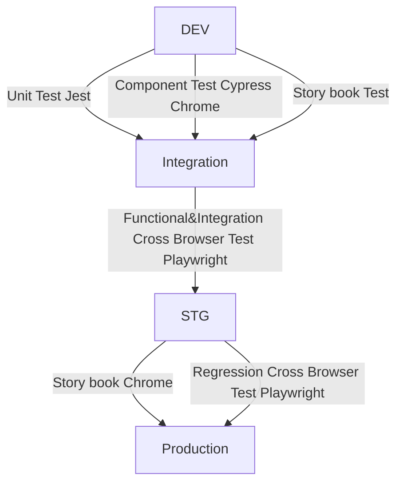
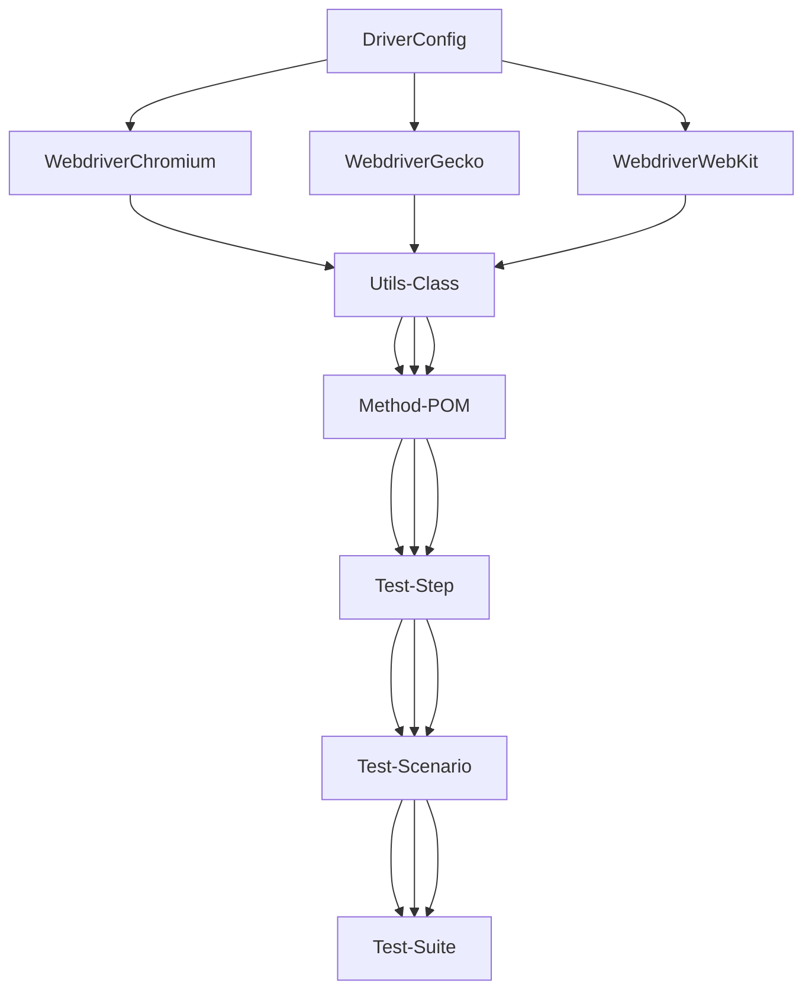

# Orca Development workflow

- [Test Category](#test-category)
- [Test Workflow from dev to production currently](#test-workflow-from-dev-to-production-currently)
- [Proposal Test Workflow from dev to production](#proposal-test-workflow-from-dev-to-production)
- [Workflow Details](#workflow-details)
- [Automation Framework Evaluation](#automation-framework-evaluation)
- [Proposal How to use the tools](#proposal-how-to-use-the-tools)
- [Structure of Automation Test Framework](#structure-of-automation-test-framework)

## Test Category

- [What is unit test](https://en.wikipedia.org/wiki/Unit_testing)

> Unit tests are typically automated tests written and run by software developers to ensure that a section of an application (known as the "unit") meets its design and behaves as intended.To isolate issues that may arise, each test case should be tested independently.

- [What is functional test](https://en.wikipedia.org/wiki/Functional_testing)

> Functional testing is a quality assurance (QA) process and a type of black-box testing that bases its test cases on the specifications of the software component under test. Functions are tested by feeding them input and examining the output, and internal program structure is rarely considered (unlike white-box testing).

- [What is integration test](https://en.wikipedia.org/wiki/Integration_testing)

> Integration testing is conducted to evaluate the compliance of a system or component with specified functional requirements.It occurs after unit testing and before system testing.

- [What is system test](https://en.wikipedia.org/wiki/System_testing)

> System testing is testing conducted on a complete integrated system to evaluate the system's compliance with its specified requirements.System testing takes, as its input, all of the integrated components that have passed integration testing.

- [What is regression test](https://en.wikipedia.org/wiki/Regression_testing)

> Regression testing (rarely, non-regression testing) is re-running functional and non-functional tests to ensure that previously developed and tested software still performs after a change. If not, that would be called a regression.

- [What is acceptance testing](https://en.wikipedia.org/wiki/Acceptance_testing)

> Acceptance testing is also known as user acceptance testing (UAT), end-user testing,formal testing with respect to user needs, requirements, and business processes conducted to determine whether a system satisfies the acceptance criteria[1] and to enable the user, customers or other authorized entity to determine whether to accept the system.
>
> > [1]Acceptance criteria are the criteria that a system or component must satisfy in order to be accepted by a user, customer, or other authorized entity.

- [What is a Test Pyramid?](https://automationstepbystep.com/2020/05/02/what-is-a-test-pyramid/)

> Test Pyramid is a model for organizing tests in a way to make the process of testing faster, efficient and cost-effective.

## Test Workflow from dev to production currently

# Proposal Test Workflow from dev to production

- unit test and component test are fast and we can use this kind of test for most coverage in dev.
- functional test and integration test are bigger and more complicated and slower a bit brittle so we do not run all of them every pr from dev so I suggest we move them to integration env.
- regression test is huge and more brittle so we only run this in STG before release.

## Workflow Details

    Dev─────────────────────────────────────────────────────────────────────────────────────────────────────
    │                                                                                                      ▲
    ├── Requirment (PM)                                                                                    │
    │       └── Define the requirements from client                                                        │
    │                                                                                                      │
    ├── Acceptance criteria for each Jira (PM & QA)                                                        │
    │       └── PM and QA define the acceptance criteria depends on the requirments                        │
    │                                                                                                      │
    ├── Test plan and Test case (QA)                                                                       │
    │       └── QA prepare the test plan and test cases depends on the acceptance criteria                 │
    │                                                                                                      │
    ├── Unit Test (DEV)                                                                                    │
    │                                                                                                      │
    ├── Cypress basic coverage component level (QA)                                                        ▲
    │                                                                                                      │
    Integration ──────────────────────────────── Bug & Improvment ────────────────────────────────────────>│
    │                                                                                                      │
    ├── Build automation tests from test plan (subtask for each Jira) (QA)                                 │
    │       └── QA work on the automation script from the test cases defined from test plan                │
    │                                                                                                      │
    ├── Manual tests from test plan (subtask for each Jira) (QA)                                           │
    │       └── QA work on the test plan which the tests are not suitable for the automation tests         │
    │                                                                                                      │
    ├── Build CI (DEV & QA)                                                                                │
    │       └── Build CI to run the tests in integration env.                                              ▲
    │                                                                                                      │
    STG ─────────────────────────────────────── Bug & Improvment ─────────────────────────────────────────>│
    │                                                                                                      │
    ├── Build automation regression test (QA)                                                              │
    │       └── Build automation regression test for STG env                                               │
    │                                                                                                      │
    ├── Build CI (DEV & QA)                                                                                │
    │       └── Build CI to run the tests in STG env.                                                      │
    │                                                                                                      ▲
    │                                                                                                      │
    Production ──────────────────────────────── Bug & Improvment ─────────────────────────────────────────>│
    │                                                                                                      │
    ├── UAT (all the users)                                                                                │
    │       └── The users should check we meet the acceptance criteria.                                    ▲
    │                                                                                                      │
    └─────────────────── Users are satisfied we continue with new features ───────────────────────────────>│

## Automation Framework Evaluation

### Cypress

> Cypress Framework is an open-source automation tool for web app testing. Cypress supports JavaScript and is used for end-to-end testing. It also supports the Mocha test framework.

### Playwright

> Playwright framework is an open-source, Nodejs based automation framework for end-to-end testing. It is developed and maintained by Microsoft. Its main goal is to run across the major browser engines – Chromium, Webkit, and Firefox.
>
> > It was forked from an earlier project called Puppeteer, but it is relatively different from it. The main difference being that Playwright was made specifically for end-to-end testing and was built for developers and testers. The team identified a gap in the ability to run automated end-to-end tests across multiple browsers.

# Proposal How to use the tools

> Use Cypress for the component test, QA refactor the current tests, move the functional and integration test to Integration enviroment test suite. QA should build the component test with Cypress in dev enviroment.

> Use Playwright for cross browser functional and integration test in integration enviroment

> Use Playwright for cross browser regression test in STG.

- Cypress run component test in dev
- Playwright (cross browser, Chromium, Gecko, Webkit) run functional and integration test in integration env
- Playwright (cross browser, Chromium, Gecko, Webkit) run regression test in STG before we release

## Structure of Automation Test Framework

